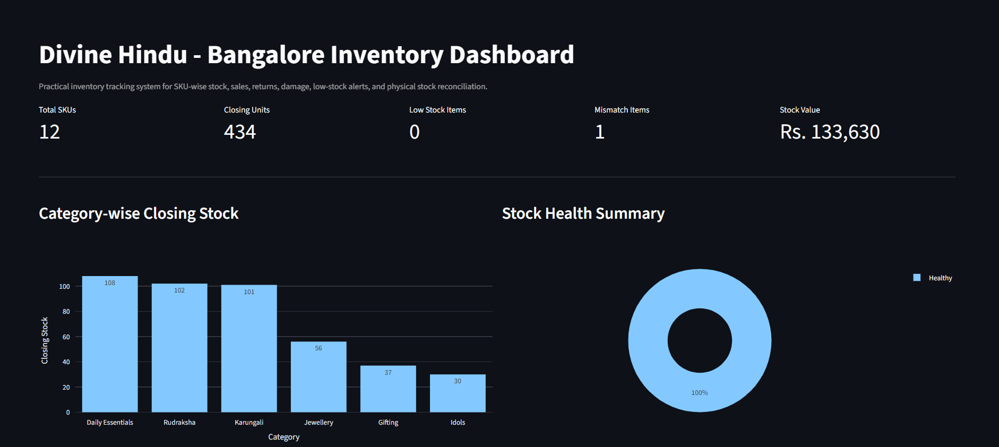
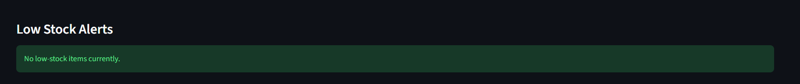
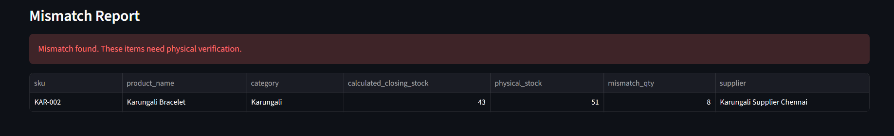
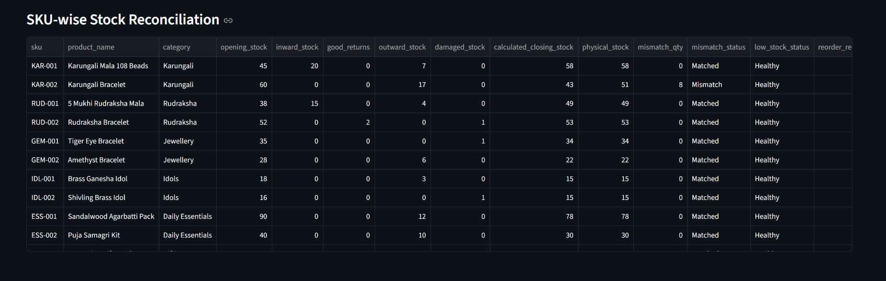
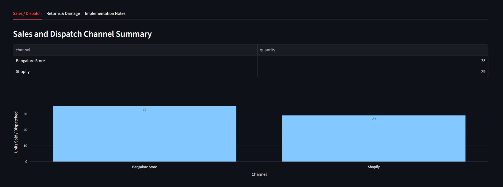
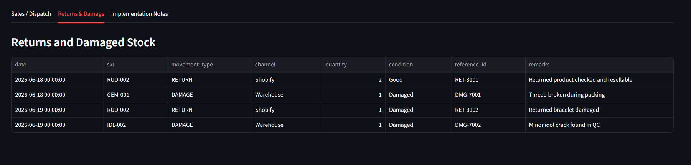
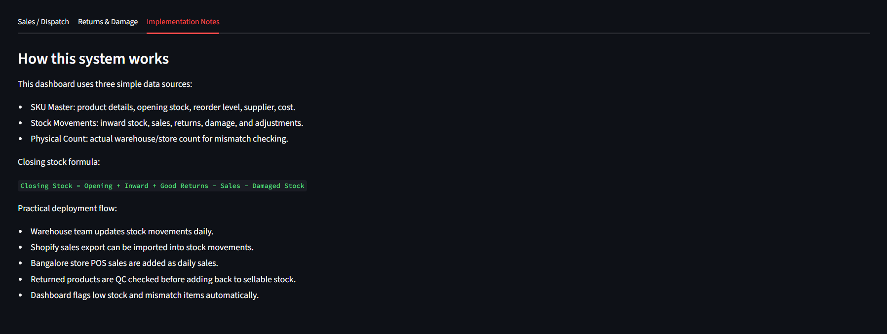

# Divine Hindu Inventory Tracking System

A practical inventory tracking prototype designed for Divine Hindu's Bangalore inventory operations.

This project helps track SKU-wise stock, inward and outward movement, Shopify/store sales, returns, damaged stock, physical stock mismatch, low-stock alerts, and reorder recommendations.

## Table of Contents

- [Project Objective](#project-objective)
- [Business Context](#business-context)
- [Core Inventory Formula](#core-inventory-formula)
- [Tools Used](#tools-used)
- [Project Structure](#project-structure)
- [Data Files](#data-files)
- [Features](#features)
- [Dashboard](#dashboard)
- [Dashboard Screenshots](#dashboard-screenshots)
- [How to Run the Project](#how-to-run-the-project)
- [Reporting Format](#reporting-format)
- [Proposed Deployment Approach](#proposed-deployment-approach)
- [Top Failure Points and Prevention](#top-failure-points-and-prevention)
- [Known Limitations](#known-limitations)
- [Scalability Plan](#scalability-plan)
- [AI Extension Ideas](#ai-extension-ideas)
- [Final Outcome](#final-outcome)
- [Author](#author)
- [License](#license)

## Project Objective

The goal of this project is to create a simple, sorted, and scalable inventory tracking system for Divine Hindu's Bangalore inventory.

The system answers key daily inventory questions:

- Which product has how much stock?
- How much stock came in?
- How much stock went out through sales or dispatch?
- How many products were returned?
- How many products are damaged or non-sellable?
- What is the calculated closing stock?
- Is system stock matching with physical stock?
- Which SKUs need reorder?

## Business Context

Divine Hindu sells spiritual and devotional products such as:

- Karungali products
- Rudraksha malas and bracelets
- Gemstone bracelets
- Idols
- Puja essentials
- Gifting combos

These products need strong inventory control because online sales, store sales, returns, damaged products, warehouse movement, and festival demand can all affect stock accuracy.

## Core Inventory Formula

```text
Closing Stock =
Opening Stock
+ Inward Stock
+ Good Returns
- Sales / Dispatch
- Damaged Stock
+/- Manual Adjustment
```

Mismatch is calculated as:

```text
Mismatch Qty = Physical Stock - Calculated Closing Stock
```

## Tools Used

- Google Sheets / CSV-style templates for inventory data entry
- Python for automation and reconciliation logic
- Pandas for stock calculation and reporting
- Streamlit for dashboard
- Plotly for visual charts

## Project Structure

```text
divine-hindu-inventory-system/
  data/
    sku_master.csv
    stock_movements.csv
    physical_count.csv
  outputs/
    daily_stock_reconciliation.csv
  app.py
  inventory_reconciliation.py
  requirements.txt
  reports_format.md
  final_assignment.md
  interview_script.md
  README.md
```

## Data Files

### 1. `sku_master.csv`

This file contains product-level master data.

Main columns:

- SKU
- Product name
- Category
- Location
- Opening stock
- Minimum stock
- Reorder quantity
- Supplier
- Unit cost
- Selling price
- Combo status

Sample rows:

| SKU | Product name | Category | Location | Opening stock | Minimum stock | Reorder quantity | Supplier | Unit cost | Selling price | Combo status |
|---|---|---|---|---|---|---|---|---|---|---|
| KAR-001 | Karungali Bracelet 8mm | Karungali | Bangalore Warehouse | 120 | 20 | 50 | Local Vendor A | 180 | 499 | No |
| RUD-001 | 5 Mukhi Rudraksha Mala | Rudraksha | Bangalore Warehouse | 60 | 10 | 30 | Nepal Supplier B | 350 | 999 | No |
| GFT-001 | Festival Gifting Combo | Gifting Combo | Bangalore Store | 25 | 5 | 15 | Internal Assembly | 600 | 1499 | Yes |

### 2. `stock_movements.csv`

This file records every stock movement.

Movement types include:

- `INWARD`
- `SALE`
- `RETURN`
- `DAMAGE`
- `ADJUSTMENT`

Main columns:

- Date
- SKU
- Movement type
- Channel
- Quantity
- Condition
- Reference ID
- Remarks

Sample rows:

| Date | SKU | Movement type | Channel | Quantity | Condition | Reference ID | Remarks |
|---|---|---|---|---|---|---|---|
| 2026-06-01 | KAR-001 | INWARD | Warehouse | 50 | Good | PO-1042 | New stock from vendor |
| 2026-06-02 | KAR-001 | SALE | Shopify | 5 | Good | ORD-5521 | Online order |
| 2026-06-05 | RUD-001 | RETURN | Shopify | 1 | Damaged | RET-203 | Mala thread broken |

### 3. `physical_count.csv`

This file contains actual counted stock from warehouse/store.

Main columns:

- Date
- SKU
- Physical stock
- Counted by
- Remarks

Sample rows:

| Date | SKU | Physical stock | Counted by | Remarks |
|---|---|---|---|---|
| 2026-06-10 | KAR-001 | 162 | Warehouse Staff 1 | Monthly count |
| 2026-06-10 | RUD-001 | 58 | Warehouse Staff 1 | Monthly count |
| 2026-06-10 | GFT-001 | 25 | Warehouse Staff 2 | Monthly count |

## Features

### SKU-wise Stock Tracking

Every product is tracked using a unique SKU code such as:

- `KAR-001` for Karungali products
- `RUD-001` for Rudraksha products
- `GEM-001` for gemstone/jewellery products
- `IDL-001` for idols
- `ESS-001` for daily essentials
- `GFT-001` for gifting combos

### Stock Reconciliation

The Python script calculates:

- Opening stock
- Inward stock
- Sales/outward stock
- Good returns
- Damaged stock
- Calculated closing stock
- Physical stock
- Mismatch quantity
- Low-stock status
- Reorder recommendation
- Stock value at cost
- Potential sales value

### Low Stock Alerts

Each SKU has a minimum stock level.

If calculated closing stock is less than or equal to minimum stock, the system marks the SKU as `Low Stock` and suggests reorder quantity.

### Mismatch Detection

The system compares calculated closing stock with physical stock.

If both do not match, the SKU is marked as `Mismatch` for review.

### Return and Damage Handling

Returns are not directly added back to sellable stock.

Return flow:

1. Return received from customer/courier.
2. QC checks product condition.
3. Good-condition returns are added back to stock.
4. Damaged returns are moved to damaged/write-off stock.
5. Return reason and reference ID are recorded.

## Dashboard

The Streamlit dashboard includes:

- Total SKUs
- Closing stock units
- Low-stock items
- Mismatch items
- Inventory value
- Category-wise closing stock chart
- Stock health summary
- Low-stock alert table
- Mismatch report
- SKU-wise stock reconciliation
- Sales/dispatch summary
- Returns and damage log

## Dashboard Screenshots

### 1. Dashboard Overview

This view shows the main inventory KPIs, category-wise closing stock, and stock health summary.



### 2. Low Stock Alerts

This section highlights SKUs that have reached or gone below their minimum stock level and need reorder attention.



### 3. Mismatch Report

This section compares calculated closing stock with physical stock and flags any mismatch for recount or correction.



### 4. SKU-wise Reconciliation Table

This table shows opening stock, inward stock, returns, outward stock, damaged stock, calculated closing stock, physical stock, mismatch status, and reorder recommendation for each SKU.



### 5. Sales and Dispatch Summary

This view shows how stock is moving out through different sales channels such as Shopify and Bangalore Store.



### 6. Returns and Damage Log

This view tracks returned and damaged products separately so non-sellable stock is not counted as available inventory.



### 7. Implementation Notes

This section explains how the system works, including the data sources, stock formula, and practical deployment flow.



## How to Run the Project

### 1. Clone or Download the Project

```bash
git clone https://github.com/Nishantt07/divine-hindu-inventory-system.git
cd divine-hindu-inventory-system
```

If running locally without GitHub, simply open the project folder in VS Code.

### 2. Install Dependencies

```bash
pip install -r requirements.txt
```

### 3. Generate Reconciliation Report

```bash
python inventory_reconciliation.py
```

This will generate:

```text
outputs/daily_stock_reconciliation.csv
```

### 4. Run the Dashboard

```bash
streamlit run app.py
```

If the above command does not work, use:

```bash
python -m streamlit run app.py
```

The dashboard will open at:

```text
http://localhost:8501
```

## Reporting Format

The system supports:

### Daily Report

Used by warehouse/inventory team.

Includes:

- Opening stock
- Inward stock
- Sales/dispatch
- Good returns
- Damaged stock
- Closing stock
- Physical stock
- Mismatch status
- Low-stock alerts

### Weekly Report

Used by operations manager.

Includes:

- Low-stock SKUs
- Mismatch SKUs
- Returned products
- Damaged products
- Fast-moving products
- Slow-moving products
- Reorder suggestions

### Monthly Report

Used by management/founders.

Includes:

- Inventory value
- Category-wise stock value
- Return and damage trend
- Stock mismatch summary
- Reorder planning
- Festival/gifting season preparation

## Proposed Deployment Approach

### Phase 1: SKU Master Setup

Create a clean SKU master with product category, opening stock, supplier, minimum stock, and reorder quantity.

### Phase 2: Stock Movement Tracking

Record inward stock, sales, returns, damage, and adjustments in one common movement ledger.

### Phase 3: Reconciliation Automation

Use Python to calculate daily closing stock, mismatch, low-stock alerts, and reorder suggestions.

### Phase 4: Dashboard

Use Streamlit dashboard for operations and management visibility.

### Phase 5: Alerts

Add email or WhatsApp alerts for low stock and mismatch.

### Phase 6: Integrations

Scale the system with Shopify API, barcode scanning, Google Apps Script, or tools like Zoho Inventory.

## Top Failure Points and Prevention

### 1. Manual Entry Errors

Risk:
Sales, returns, or damaged stock may be entered incorrectly.

Prevention:
Use dropdowns, SKU validation, required fields, barcode scanning, and daily reconciliation.

### 2. Returned Products Added Without QC

Risk:
Damaged returned products may be added back to sellable stock.

Prevention:
Add a return QC step. Only good-condition returns go back to sellable stock. Damaged returns go to damaged/write-off stock.

### 3. Physical Stock Mismatch

Risk:
System stock may not match warehouse/store stock.

Prevention:
Compare calculated closing stock with physical count and flag mismatch items for recount and correction.

## Known Limitations

This is a prototype built for a single-location, single-user workflow. Current limitations include:

- **No concurrency handling** — CSV-based storage means simultaneous edits by multiple users can overwrite each other's changes.
- **No real-time sync** — stock movements are batch-processed when the reconciliation script is run, not updated live.
- **No authentication or role-based access** — anyone with file access can view or edit all data.
- **No database backend** — CSV files do not scale well beyond a few thousand SKUs or movement records.
- **No automated data validation** — incorrect SKU codes, negative quantities, or duplicate entries are not currently caught at entry time.
- **No combo/BOM (Bill of Materials) breakdown** — gifting combos are tracked as a single SKU, not broken into component stock.
- **No batch or expiry tracking** — relevant for future categories with shelf life.
- **Single-location only** — current design assumes one warehouse/store; multi-location support is planned but not implemented.

These are intentional scope cuts for a first working prototype, with a clear upgrade path outlined in the Scalability Plan below.

## Scalability Plan

This system can start with Google Sheets and Python because it is simple and practical.

Later, it can be improved with:

- Shopify API integration
- Barcode scanning
- Google Apps Script alerts
- WhatsApp/email alerts
- Role-based access
- Multi-location inventory tracking
- Combo product BOM tracking
- Batch/expiry tracking
- Supplier reorder automation
- AI-based demand forecasting

## AI Extension Ideas

AI can be added later for:

- Festival demand forecasting
- Fast-moving and slow-moving SKU detection
- Return reason analysis
- Smart reorder recommendation
- Mismatch anomaly detection
- Supplier planning

## Final Outcome

This inventory tracking system helps Divine Hindu maintain accurate Bangalore inventory by tracking product-wise stock, sales, returns, damaged items, physical mismatches, and reorder needs.

The solution is simple enough for daily operations and scalable enough for future automation and integrations.

## Author

**Nishant**
AI/ML Engineer | GenAI & RAG Systems
GitHub: [github.com/Nishantt07](https://github.com/Nishantt07)

## License

This project is licensed under the MIT License. See the `LICENSE` file for details.
